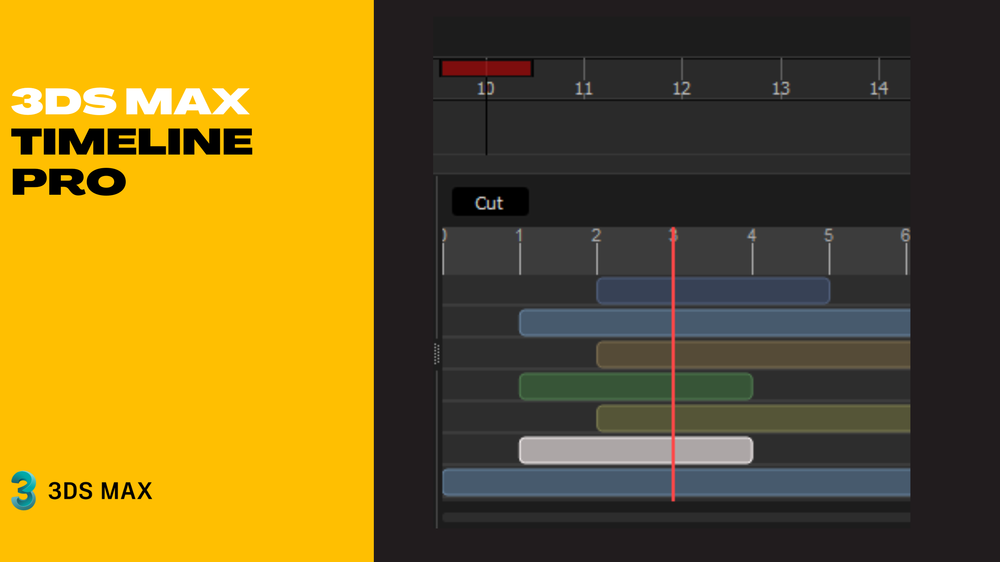

# TIMELINE Pro (Open Beta) 🚀
for Autodesk 3ds Max 2025+

### Introduction

**TimelinePro** is an advanced, non-linear timeline editor for 3ds Max, designed to provide professional-grade control over animation. Inspired by video editing software, TimelinePro allows artists to work with animation clips as layers, making it easier to experiment, reuse animations, and build complex sequences.


[](https://www.paypal.com/donate/?hosted_button_id=LAMNRY6DDWDC4)



***

📜 [View Changelog](CHANGELOG.md)

🛣️ [RoadMap](https://trello.com/b/5ucp31ej)

### ⚠️ Beta Disclaimer

Please note that **TimelinePro** is currently in a **beta** phase and is under active development. This means it may contain bugs, unexpected behavior, or missing features.

**It is not recommended for use in critical, deadline-sensitive production environments.** Please use it at your own risk and always back up your important scenes before using it.

***

### ❤️ Feedback & Contributions

Your feedback is invaluable in making TimelinePro better! If you find a bug or have an idea for an improvement, please let us know.

* 🐛 **Reporting Bugs:** The best way to report a bug is by opening an **Issue** on this GitHub repository. Please be as detailed as possible: include steps to reproduce the issue, your version of 3ds Max, and any relevant screenshots. Alternatively, you can send a detailed report via **Pull Request** or email at `[imanshirani @ gmail.com]`.

* 💡 **Suggesting Features:** Have an idea for a new feature? We'd love to hear it! Please open an **Issue** and describe your suggestion. You can also submit your ideas through a **Pull Request** or by emailing us.

***

### 🚀 Key Features

* **🎬 Non-Linear Clip-Based Editing:**
    * **Capture Animation:** Automatically captures an object's keyframes and converts them into a self-contained animation "clip".
    * **Clip Editing:** Move, trim, scale, and adjust the duration of animation clips directly on the timeline.
    * **Hierarchy Support:** Export and import clips that include the animation of an object and all its children, preserving the hierarchical relationship.

* **🥞 Layers & Motion Mixer:**
    * **Animation Layers:** Organize clips into vertical tracks. Upper layers can override or blend with the layers below.
    * **Import Clips:** Import saved `.clip` files directly into the mixer to reuse animations across different scenes and objects.
    * **Bake to Scene:** Bake the final result of all mixer layers into standard keyframes on your selected object.

* **🌳 Advanced Track Editor:**
    * **Hierarchical View:** Expand any object to see and edit all its animatable tracks (Position, Rotation, Modifiers, etc.) in a tree structure.
    * **Direct Value Editing:** Modify track values directly in the UI using interactive "scrubbers" for `Point3`, `Quat`, and `Float` values.
    * **Assign Controllers:** Right-click any track to assign a new controller type (e.g., from Bezier to Noise), filtered by compatibility.
    * **Search & Filter Support:** Quickly search for layers and hide unwanted tracks to keep the timeline clean and organized.

* **🔑 Keyframe Management:**
    * **Visual Editing:** Select, move, and delete keyframes directly in the timeline area.
    * **Marquee Selection:** Use marquee (drag) selection to select and edit multiple keyframes at once.
    * **Easing Support:** Apply common easing functions (Ease In/Out for Sine, Quad, Cubic) to selected keyframes.

* **🎨 Intuitive User Interface:**
    * **Zoom & Scroll Timeline:** Easily navigate your scene using a zoom slider and the mouse wheel.
    * **Real-Time Sync:** The timeline and time slider are automatically synchronized with your 3ds Max scene.
    * **Settings Panel:** Customize the appearance, layer colors, and editor behavior.

* **💾 Session Saving & Loading:**
    * **Persistence:** The complete state of your TimelinePro (clips, tracks, etc.) is automatically saved in a `.timeline` file alongside your 3ds Max scene, loading back up the next time you open the file.

***

### 📦 Installation

1.  **Download:** Download the latest release from the repository.
2.  **Unpack:** Unzip the contents to a safe location.
3.  **Run Timeline:** 
    **Toolbar (Optional but Recommended):**
    * Go to `Script` > `Run Script`.
    * Select `launch_timeline.py` File, click `Open`.
    * Now, you can see `TimelinePro` under the original Timeline

or 

## 📦 Installation

Installing the plugin is quick and requires no manual setup in 3ds Max.

1. **Unzip** the downloaded package.
2. **Copy** the `.bundle` folder to the Autodesk Application Plugins directory:
   ```text
   C:\ProgramData\Autodesk\ApplicationPlugins

***

### 📖 How to Use (Quick Start)

Here is a basic cookbook to get you started with TimelinePro.

#### 1. Launch & Add Your First Clip
* Open TimelinePro by clicking its toolbar button or by running the `launch_timeline.py` script.
* Select an animated object in your 3ds Max scene.
* In the **Track List** view, click the **+ Add** button. TimelinePro will capture its animation and create your first clip.

#### 2. Basic Clip Editing
* **Move:** Click and drag the main body of the clip to move it left or right on the timeline.
* **Trim:** Hover over the start or end edge of the clip until the cursor changes, then click and drag to trim it.
* **Scale:** Hold the `Alt` key while dragging an edge to scale the entire clip, speeding up or slowing down the animation within.

#### 3. Working with Tracks
* Click the small arrow next to your clip's name to expand it.
* You will see all the animatable properties of your object. You can expand these further (e.g., expand `Transform` to see `Position`, `Rotation`, and `Scale`).
* The values for each track at the current time are displayed in the **Value** column. You can click and drag horizontally on these values to "scrub" them.

#### 4. Using the Motion Mixer
* Switch to the mixer by clicking the **Motion Mixer** button.
* Click **+ Import Clip** to load a previously exported `.clip` file. This will create a new track and clip.
* You can import multiple clips and stack them vertically. The mixer processes layers from the bottom up.
* When you are happy with the result, select the root object in your scene that you want the animation applied to, and click **Bake Mixer**.

#### 5. Exporting Animations
* In the **Track List** view, right-click on a top-level clip.
* Select **Export Animation as .clip**.
* This saves the entire animation hierarchy of that clip into a file that you can reuse later in the Motion Mixer.
